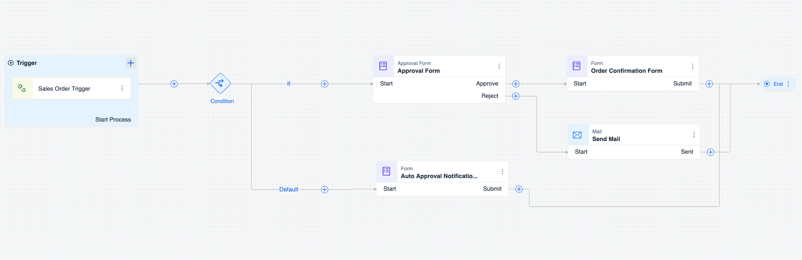
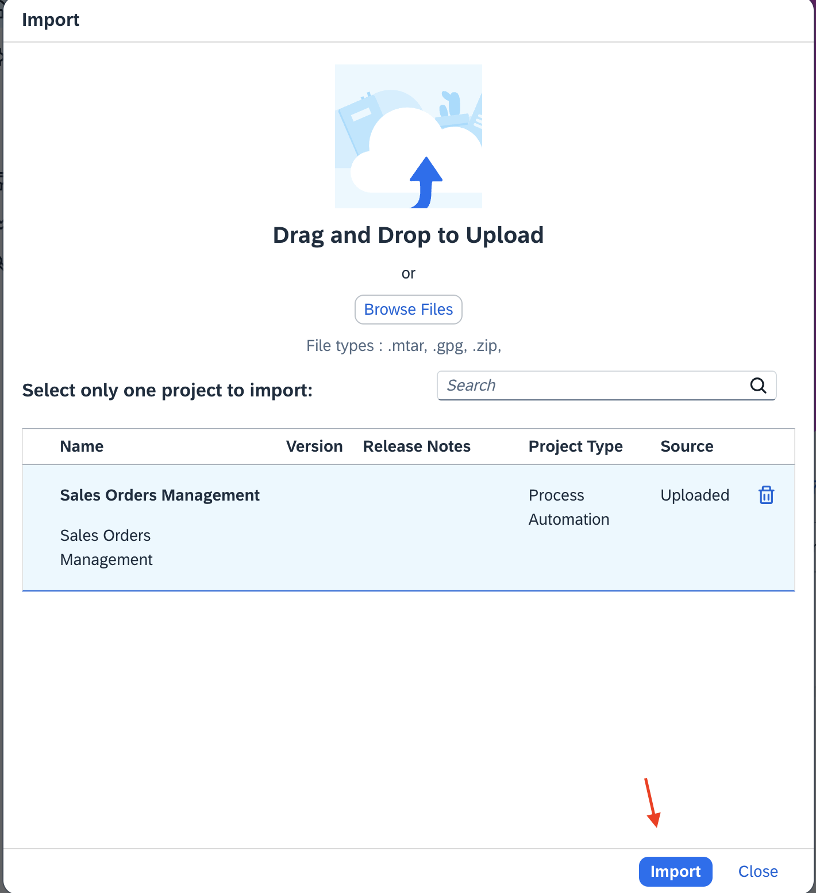
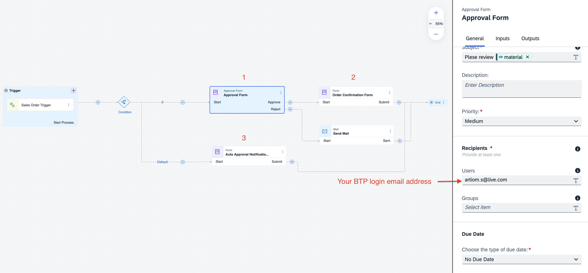

# Exercise 1.1 - Create Sales Order Business Process 

In this exercise, we use SAP Build Process Automation to create a simple process for approving a sales order.

The process receives the sales order details and then either:

- Automatically approves the sales order if it is below a certain threshold.
  
- Sends an approval form to the specified approver. Once the approver approves, the process ends. 

## Download

Please utilize the provided MTAR file to import a pre-existing Sales Order Business Process.

- [Sales Orders Management.mtar](../ex1.1/Sales%20Orders%20Management.mtar)

## Import a pre-existing process

## Change Recipients e-mail address

