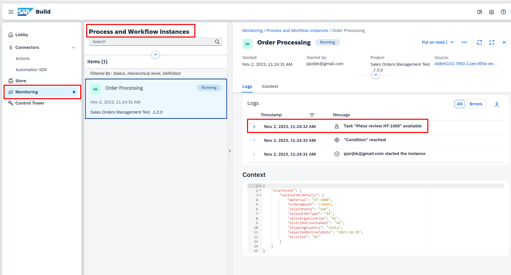

# Exercise 1.2 - Run Sales Order Business Process 

In this exercise, we will deploy the process, trigger the process, and then discover the tools for monitoring the process.

## Exercises

Perform all the steps in 👉 tutorial: 

- [Run the Sales Order Business Process](https://developers.sap.com/tutorials/spa-academy-run-salesorderprocess.html)