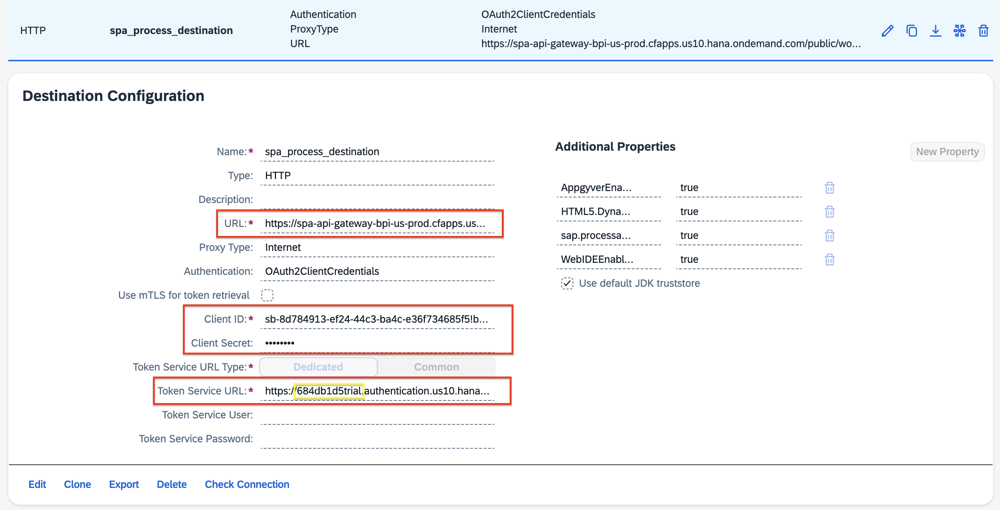
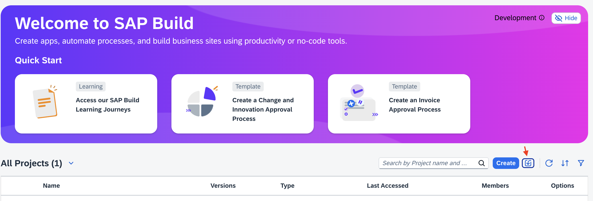
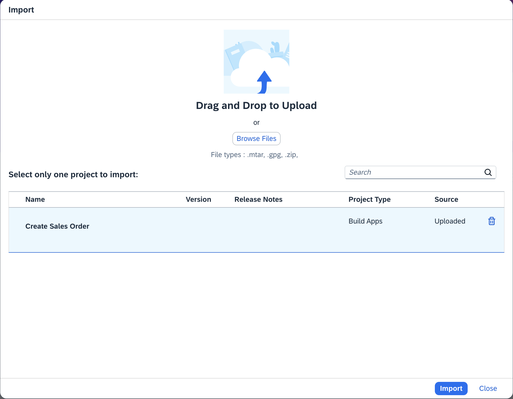
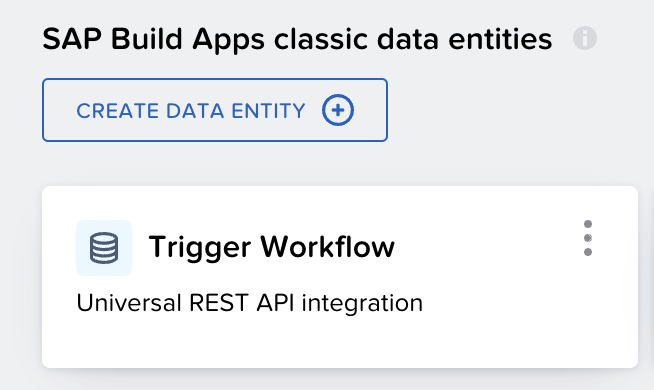
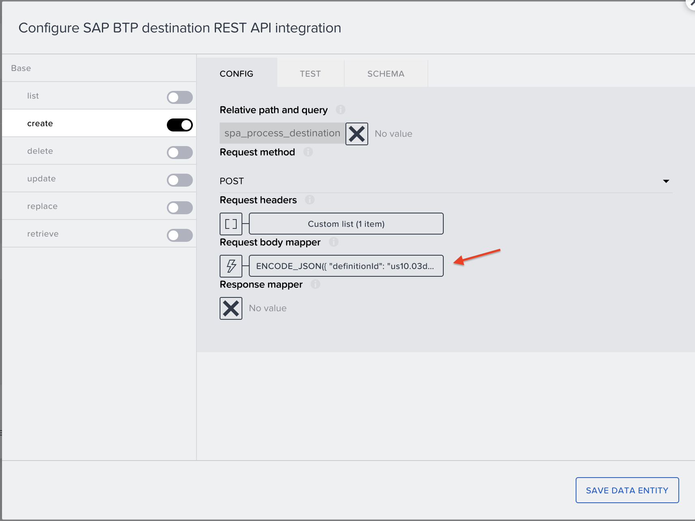
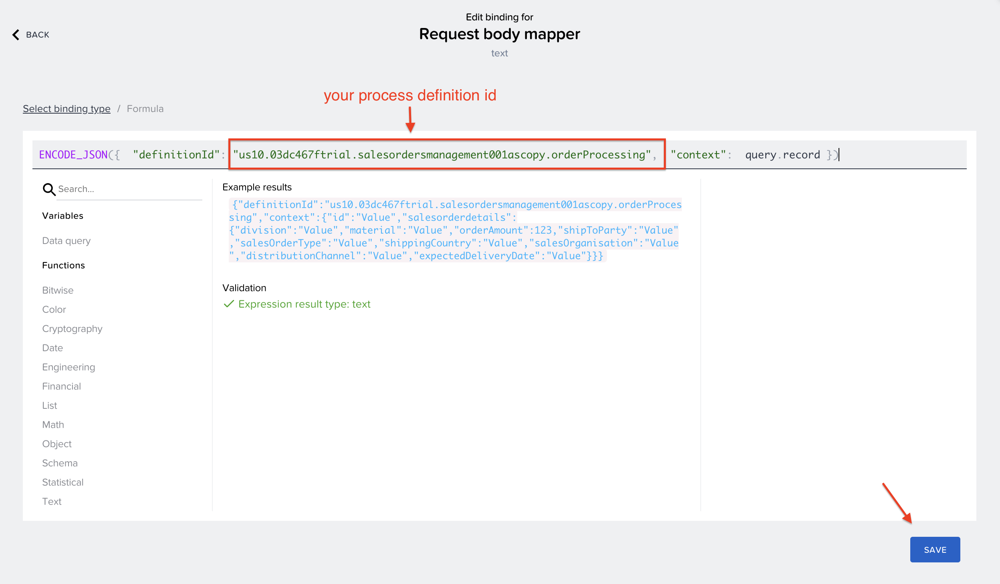
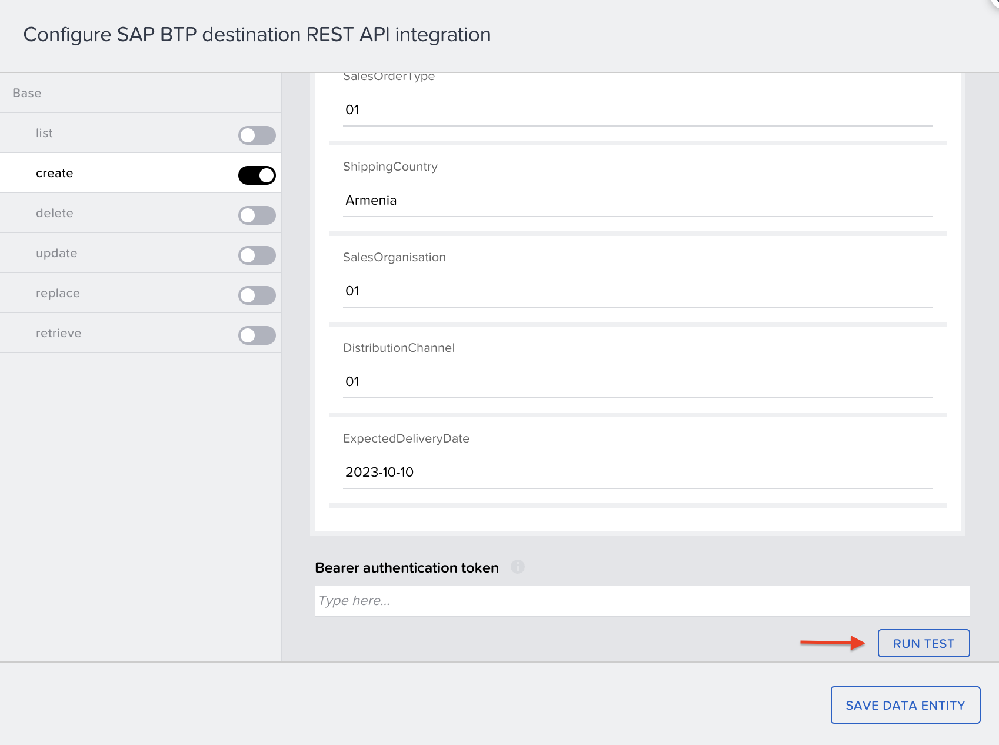
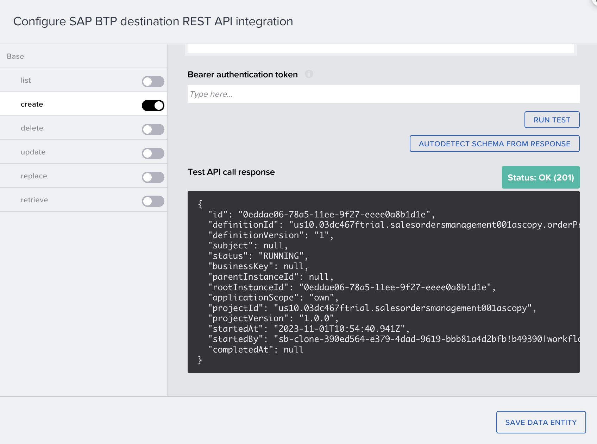
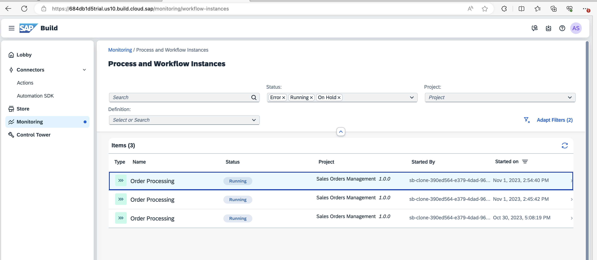

# Exercise 2 - SAP Build Apps

This section of exercises focuses on SAP Build Apps, specifically the creation of an app to trigger a process created with SAP Build Process Automation.

## Exercises

* [Exercise 2.1 - Create SAP Build App to Trigger Workflow](/exercises/ex2-SAP-Build-Apps/ex2.1/README.md)

* [Exercise 2.2 - Populate Dropdown with SAP Data (ES5)](/exercises/ex2-SAP-Build-Apps/ex2.2/README.md) 

* [Exercise 2.3 - Check Status of Process from SAP Build App](/exercises/ex2-SAP-Build-Apps/ex2.3/README.md) 

* [Exercise 2.4 - Deploy SAP Build App to SAP BTP](/exercises/ex2-SAP-Build-Apps/ex2.4/README.md) 

## Prerequisite

To trigger the workflow through the BUILD application, your initial step involves setting up a BTP destination that directs to the workflow instances.
You have the option to either create a new destination or import an already existing one from. [here](../../exercises/ex2-SAP-Build-Apps/destinations/spa_process_destination)

Please ensure to update the destination's settings.

## Download

Please utilize the provided MTAR file to import a pre-existing Create Sales Order application.

- [Create Sales Order.mtar](../ex2-SAP-Build-Apps/Create%20Sales%20Order.mtar)

## Import a pre-existing application

## Test Workflow Trigger

